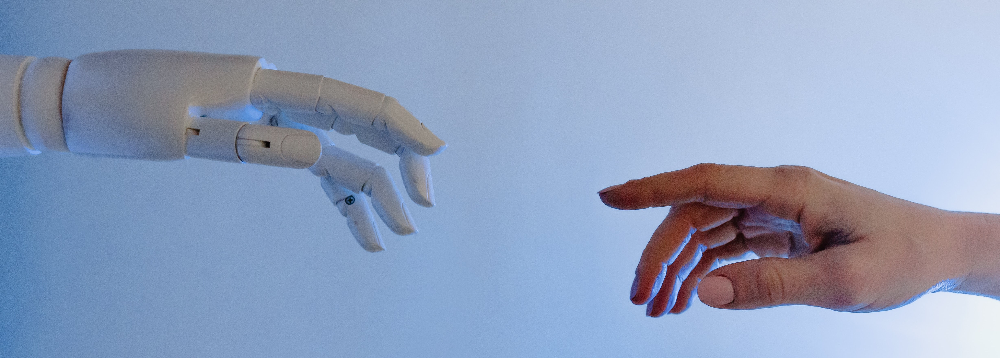

# Definition and Usage of AI
As already indicated in the last blog post, I would like to focus more on the alleged existential risk of artificial intelligence in the following. Since, with my current level of knowledge, I have actually often classified AI as a cool tool that can do cool things, I would like to use my further research to find out what negative sides AI can bring with it. Above all, I want to find out at what point AI itself can be classified as an existential risk and to what extent AI can have an impact on other existential risks.  
Before I do this, however, I would first like to find out what AI actually is.   

  

## Definition
Defining the term artificial intelligence seems to be extremely difficult, as - just like definitions about [Existential Risks](/pages/3_existential_risks.md) - there are [entire papers](https://arxiv.org/pdf/1210.1568.pdf) in the literature trying to define the term. This shows how complex the whole topic of artificial intelligence is.  
It seems therefore essential to take a closer look at this topic and, especially in times of digitalisation, to deal more with the complexity, the advantages but also the risks.
  
**Oxford Languages** has found a relatively simple definition and describes artificial intelligence as: 
> *„the theory and development of computer systems able to perform tasks normally requiring human intelligence, such as visual perception, speech recognition, decision-making, and translation between languages”.*

[**Accenture**](https://www.accenture.com/us-en/insights/artificial-intelligence-summary-index) describes AI as:
> *“Artificial intelligence is a constellation of many different technologies working together to enable machines to sense, comprehend, act, and learn with human-like levels of intelligence. Maybe that’s why it seems as though everyone’s definition of artificial intelligence is different: AI isn’t just one thing.”*

Here it can again be seen that AI is not easy to describe, as it *"isn't just one thing"*. AI can already be found in many daily situations in our lives:

## Usage of AI in the Daily Life
We already encounter AI almost every day without even noticing it. Examples include social media, autonomous vehicles and aircraft, digital assistants, and many more. In order to show how many situations AI is already being used in today, I would like to present the entire list created by [Dataconomy.com](https://dataconomy.com/2022/05/artificial-intelligence-in-everyday-life/). For more detailed descriptions, the website is definitely worth a visit!  
- Social Media
- Autonomous vehicles and aircraft
- Digital assistants
- Food ordering sites
- Music and media streaming services
- Plagiarism
- Banking
- Online commerce (eCommerce) and shopping
- Navigation and travel
- Transportation
- Video games 
- Email system 
- Video games
- Job seeking apps
- Audio to text converters
- Security and surveillance
- Smart Home
- Google predictive search algorithms 
- Internet of Things
- Recipes and cooking
- Autocorrect  
- Medical application

   

## Narrow AI vs. General AI
As you could now see here, AI can already be discovered in many situations in our daily lives. However, not all AI is the same, but a distinction can be made in terms of AI's capabilities. It can be deeper differentiated  between so-called Artificial **narrow (or "weak")** Intelligence, Artificial **general (or "strong")** Intelligence and Artificial **Super**intelligence:
### Artificial Narrow (or "weak") Intelligence
Artificial Narrow Intelligence (ANI) can be seen as AI, “which performs a single task or a set of closely related tasks” ([Accenture](https://www.accenture.com/us-en/insights/artificial-intelligence-summary-index)). It “refers to any AI that can outperform a human in a narrowly defined and structured task. It is designed to perform a single function like an internet search, face recognition, or speech detection under various constraints and limitations. It is the constraints that lead people to refer to these functions as ‘narrow’ or ‘weak’” ([levity.ai](https://levity.ai/blog/general-ai-vs-narrow-ai)). Narrow AIs are therefore copying human behavior “based on a set of rules, parameters, and contexts that they are trained with” and are not thinking for themselves ([levity.ai](https://levity.ai/blog/general-ai-vs-narrow-ai)).  
Examples for ANI:
- Weather apps
- Digital assistants
- Software that analyzes data to optimize a given business function 
- Searching the Internet
- Facial Recognition
- Recommender systems (e. g. movie recommendations on Netflix)

[Accenture](https://www.accenture.com/us-en/insights/artificial-intelligence-summary-index) says that "these systems are powerful, but the playing field is narrow: They tend to be focused on driving efficiencies. But, with the right application, narrow AI has immense transformational power—and it continues to influence how we work and live on a global scale.” 

Such ANI systems can bring some advantages: For one thing, they can **increase productivity and efficiency**, as they can mimic human behaviour and thus relieve or facilitate people's work. In addition, ANI systems help **to make decisions**. Algorithms can recognise patterns and make better decisions based on them. Similarly, a **better customer experience** can be achieved, for example through the above-mentioned recommender systems ([levity.ai](https://levity.ai/blog/general-ai-vs-narrow-ai)).

### Artificial General (or "strong") Intelligence
The main difference between Artificial Narrow Intelligence and Artificial General Intelligence is that with ANI, the AI only imitates human behaviour, takes over repetitive tasks, etc.. With AGI, however, the AI can develop itself further, learn skills and behave and develop more and more like a human being. AGI is still very nascent, however, and ANI is therefore the current state of AI, AGI the state that would like to be achieved ([levity.ai](https://levity.ai/blog/general-ai-vs-narrow-ai)). Since ANI cannot yet do this, "human-machine collaboration is crucial - in today's world, artificial intelligence remains an extension of human capabilities, not a replacement" ([Accenture](https://www.accenture.com/us-en/insights/artificial-intelligence-summary-index)).  
Examples for AGI can be seen within:
- Chatbots
- Autonomous vehicles

### Artificial Superintelligence
At first I only found the Accenture source, which only dealt with ANI and AGI. In the course of my research, I came across levity.ai, which also listed Artificial Superintelligence (ASI).  
ASI is the highest level in which "Artificial Superintelligence (ASI) would be capable of outperforming humans" ([levity.ai](https://levity.ai/blog/general-ai-vs-narrow-ai)).

## Outcome
The aim of this section of my research was to gain a basic understanding of AI and to derive the next steps of my research. With the realisation that AI has three levels, and the highest level - Artificial Superintelligence - would be able to outperform humans, I can confirm my one idea that AI itself can pose an existential risk. Moreover, AI is present in so many everyday situations that I would like to take a closer look at the extent to which AI can possibly have an indirect effect on existential risks with an intermediate step. 
Therefore, I will now divide my research into two parts: On the one hand, AI as an existential risk and, on the other, AI as an indirect influence on existential risks.
  
## Navigation
Back to the post about [Existential Risks](3_existential_risks.md)! 
Take me to the post about [Artificial Intelligence as an Existential Risk](5_ai_as_er.md)! 
Take me to the post about [Artificial Intelligence as indirect influence on Existential Risks](6_ai_and_politics.md)! 
