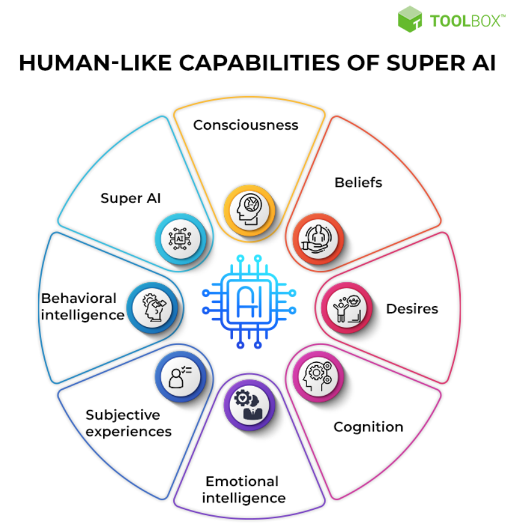

# Is Artifical Intelligence itself an Existential Risk?
In my last blog post about AI in general, I explored the different levels of AI. The third level, Artificial Superintelligence, was also introduced. In the literature, this was described as the state in which AI "would be capable of outperforming humans" ([levity.ai](https://levity.ai/blog/general-ai-vs-narrow-ai)). Therefore, in this post I would like to think about which scenarios there would be and to what extent these would allow AI to be classified as an existential risk. 
To do this, I would first like to learn more about artificial superintelligence.
## Definition
> „Artificial superintelligence (ASI) is a form of AI that is capable of surpassing human intelligence by manifesting cognitive skills and developing thinking skills of its own. Also known as super AI, artificial superintelligence is considered the most advanced, powerful, and intelligent type of AI that transcends the intelligence of some of the brightest minds, such as Albert Einstein” ([spiceworks.com](https://www.spiceworks.com/tech/artificial-intelligence/articles/super-artificial-intelligence/)).

According to spiceworks.com, ASI is able to acquire and develop all these human skills:  

  

If you take a closer look at when such a state of Artificial Super Intelligence could possibly occur, opinions differ. The majority of opinions, however, are found in a time span of 20 to 30 years: Louis Rosenberg - computer scientist and entrepreneur - speaks of 2030, Ray Kurzweil - computer scientist - of 2045 and Jurgen Schmidhuber - co-founder of NNAISENSE, a Swiss AI startup - of 2050. However, no one can predict with certainty whether and when such Artificial Superintelligence will exist ([levity.ai](https://levity.ai/blog/general-ai-vs-narrow-ai)).
## Characteristics
In the Journal of Artificial Intelligence Research 70 (2021), the following characteristics of ASI can be recognised ([spiceworks.com](https://www.spiceworks.com/tech/artificial-intelligence/articles/super-artificial-intelligence/)):
1. Because ASI will continually improve and grow more intelligent, it will be one of the best and perhaps the **final innovations** that humans will ever need to create.
2. The emergence of superintelligence will hasten **technological advancement** in a variety of areas, including academia, space exploration, pharmaceutical discovery and development, and many others.
3. ASI may further grow and produce sophisticated kinds of superintelligence that might even make it possible to **duplicate human minds**.
4. ASI may eventually result in the **technological singularity**.

## Potential Advantages
[Spiceworks.com](https://www.spiceworks.com/tech/artificial-intelligence/articles/super-artificial-intelligence/) identified five major potential advantages of ASI:  

  

##### 1. Reduction in human error
By using ASI, errors that humans usually make unavoidable can be reduced. Especially in the case of syntactic, logical, arithmetic and resource-related problems, ASI can develop logic independently and minimise errors.
##### 2. Replace humans to accomplish risky tasks 
So while some tasks are too risky for humans (e.g. defusing a bomb) or outright impossible (e.g. working under nuclear radiation), such tasks could be accomplished with the help of superintelligent technologies such as robots. It is therefore a question of overcoming risk limitations.
##### 3. 24×7 Availability
With the help of super AI, the breaks that people have between their working hours (to sleep or have free time, for example) could be bridged, creating 24/7 availability in e.g. counselling centres. 
##### 4. Explore new science frontiers
Super AI tools can also be used to advance research. Especially in the field of space science, the extreme reasoning ability of super AI can be used to, for example, "test and estimate the probability of success of many equations, theories, research, rocket launches and space missions"
##### 5. Medical advances
Super AI can also bring benefits to the healthcare industry. “A 2020 research paper in Nature revealed the design and use of miniaturised intelligent nanorobots for intracellular drug delivery. […] With the addition of conscious superintelligence, the discovery and administration of new drug strains will become much more effective.”

## Risks
While some may emphasise the emerging opportunities, there are also those who are more critical of the whole development and point out the risks. Even though I have now discovered the characteristics and potentials of ASI, I am now more critical of ASI than I was at the beginning.  
The next step will be to look at the exact risks that ASI entails:   
Referring to the recent study published in the Journal of Artificial Intelligence Research in January 2021, it was found that "it would be almost impossible for humans to contain super AIs ([spiceworks.com](https://www.spiceworks.com/tech/artificial-intelligence/articles/super-artificial-intelligence/)). Let us now take a closer look at the risks associated with ASI in order to validate this very definitive statement.

  

##### 1. Loss of control and understanding
ASI tools pose a risk in this respect, as they could "use their power and capabilities to perform unforeseen actions, surpassing human intellect and eventually becoming unstoppable". This could result in an intelligence so great that it could no longer be contained with human capabilities. "The loss of control and understanding may thus lead to the total annihilation of the human race." ([spiceworks.com](https://www.spiceworks.com/tech/artificial-intelligence/articles/super-artificial-intelligence/))
##### 2. The weaponization of super AI
This unstoppable and superhuman intelligence can equally be used to gain social control with weaponisation. This complementary power of an armed superintelligence would have a strong negative impact on warfare.
##### 3. Failure to align human and AI goals
ASI can also pose a threat if its goals are not clearly defined and aligned with us humanity. As examples, [spiceworks.com](https://www.spiceworks.com/tech/artificial-intelligence/articles/super-artificial-intelligence/) cites the following: "If you command an intelligent car to take you to the airport as quickly as possible, it may take you to your destination, but may choose its own route to meet the timing." Or "if a super AI system is tasked with a critical geoengineering project: It could disrupt the entire ecosystem while carrying out the project. Moreover, any human attempt to stop the super AI system could be seen by it as a threat to achieving its goals, which would not be an ideal situation." ([spiceworks.com](https://www.spiceworks.com/tech/artificial-intelligence/articles/super-artificial-intelligence/))
##### 4. Malevolent superintelligence
Always constant will be the question of morality. ASI systems can bring some advantages, but the question is to what extent this is still justifiable and to what extent one can justify the devastating consequences if such systems fall into the wrong hands and are abused.
##### 5. The danger of nuclear attacks
Following on from the threat of weaponisation of super AI, with ASI "autonomous weapons, drones and robots could gain significant power" ([spiceworks.com](https://www.spiceworks.com/tech/artificial-intelligence/articles/super-artificial-intelligence/)). In the process, countries that have such advanced technologies could be vastly superior to other countries, which would in turn lead to total destruction.
##### 6. Ethical implications
Humans are all different. Everyone holds their own values and considers things right or wrong. ASI systems must be programmed with such values. However, since everyone holds different values and there is no single standard, there can be considerable conflict, "especially if the AI surpasses human intellect but is not programmed with the moral and ethical values that are consistent with human society." ([spiceworks.com](https://www.spiceworks.com/tech/artificial-intelligence/articles/super-artificial-intelligence/))

## Conclusion
If we now weigh the advantages against the disadvantages, we can see that the advantages are mostly simply facilitations of our daily lives. However, we could survive without them without any problems and it would only be an additional benefit, so to speak, and not a necessary one. However, if we then compare the dangers, I think we can come to the conclusion that especially the aspect of the total superiority of AI systems and the resulting total loss of control, which puts the existence of humanity in danger, outweighs all the advantages. While Narrow and General AI can be used as cool "nice-to-have" tools and thus therefore not pose a threat for humanity, Artificial Superintelligence can definitely be seen as an existential risk for humanity. So it cannot be said that AI in general poses an existential risk, but only the most extreme part of it: the Artificial Superintelligence.
## Navigation
Back to the post about [Artificial Intelligence](4_ai.md) in general! 
Take me to the post about [AI as indirect Influence on Existential Risks](6_ai_and_politics.md)! 
